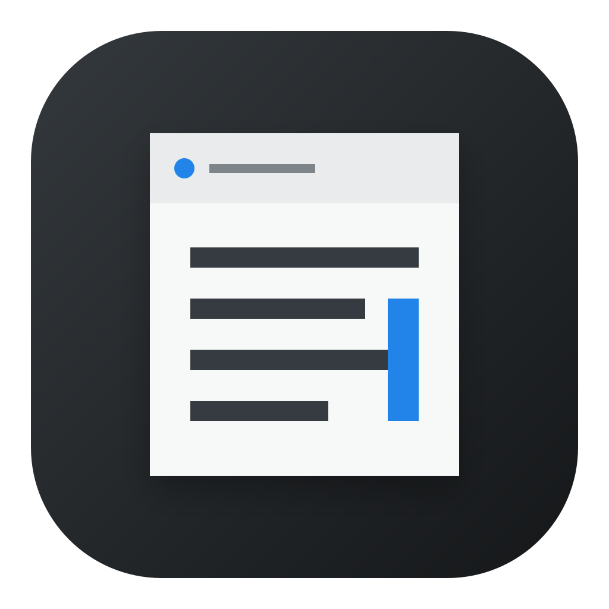
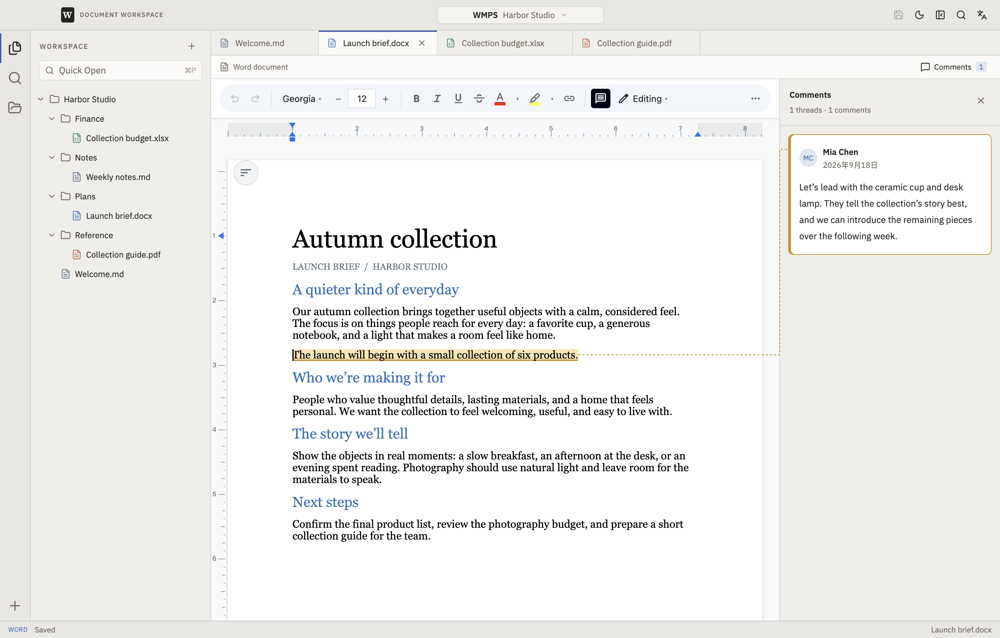
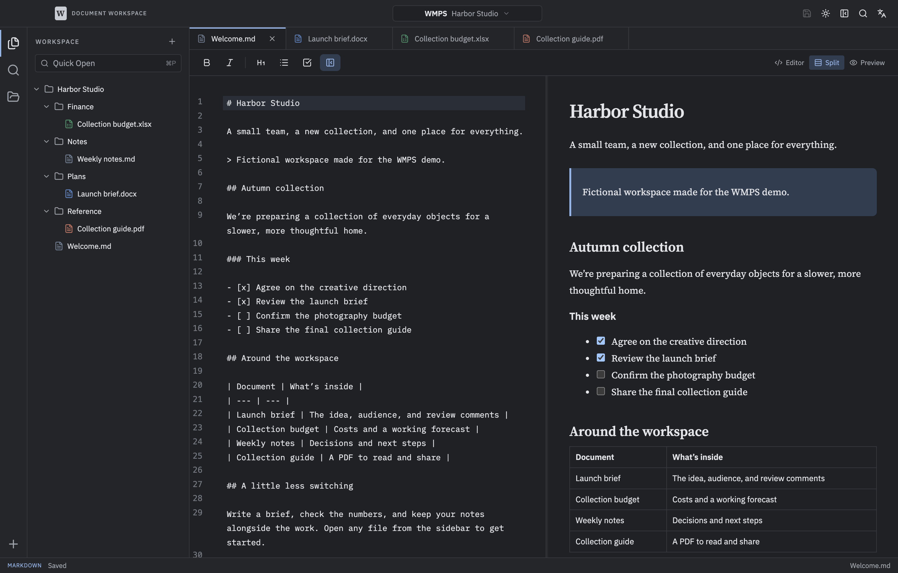

  

<h1 align="center">WMPS</h1>

Your documents, one workspace.

WMPS is a desktop app for working with Word documents, spreadsheets, Markdown, and PDFs in one place. Open a folder, browse your files in the sidebar, and switch between documents with tabs.

No account. No uploads. Your files stay on your computer.

## A home for all your documents

- **Word documents** — Write and format documents. Read existing comments beside the page, with highlighted text linked directly to each comment.
- **Spreadsheets** — Work with cells, formulas, and multiple sheets.
- **Markdown** — Write on the left and see a live preview on the right.
- **PDFs** — Read, search, and zoom without leaving your workspace.
- **Folders and tabs** — Keep project files together and move between them quickly.
- **Search** — Find file names, document text, spreadsheet cells, and Word comments across your folder.
- **Light and dark** — Choose a look that suits your workspace, or follow your system setting.

## Get started

WMPS currently runs on **Apple Silicon Macs**. Windows and Linux builds are not available yet.

This repository currently provides the source code. See the [setup guide](docs/DEVELOPMENT.md#run-the-app) to run the app or create a macOS installer.

Once you’re in:

1. Choose **Open Folder** and select a folder of documents.
2. Click a file in the sidebar to open it.
3. Make your changes and press **⌘S** to save.

Want to look around first? Open [Harbor Studio](examples/Harbor%20Studio), the fictional project used in the screenshots. It includes a launch brief with a comment, a budget, notes, and a PDF.

## A few useful shortcuts

| Shortcut | Action |
| --- | --- |
| ⌘P | Find and open a file |
| ⌘S | Save the current document |
| ⌘W | Close the current tab |

## What to expect

WMPS is an early release. Word comments can be read and followed, but adding or editing comments is not yet supported. PDFs and HTML files open as previews.

Complex Office documents may look different, and some advanced spreadsheet features may not survive saving. Keep an original copy of important files. The [compatibility notes](FIDELITY.md) explain the current limits.

## Feedback and contributions

Found a problem or have an idea? [Open an issue](https://github.com/jianghuawang/wmps/issues). For build instructions and technical details, see the [development guide](docs/DEVELOPMENT.md).

WMPS is open source under the [MIT license](LICENSE). See [third-party notices](THIRD_PARTY_NOTICES.md) for the libraries that make it possible.
